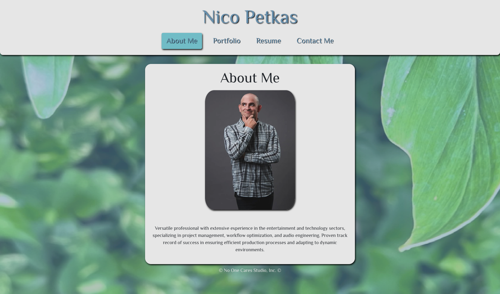

# npetkas-react-portfolio

## Description

Npetkas React Portfolio is created to show potential employers what i can offer to the company. 
This app can help anyonebuild a standard portfolio highlighting who you are, projects you've finished, 
resume and contact info . For reference, this build demonstrates how to create a Vite config, 
setting up routes in react, importing fonts and icons, and email validation.

## Table of Contents

- [Installation](#installation)
- [Contributing](#contributing)
- [Application](#application)
- [Questions](#questions)

## Installation

1. Clone the repository `git clone git@github.com:NPetkas/npetkas-react-portfolio.git`
2. Navigate to the project directory in terminal
3. Install dependencies `npm i`
4. Application build `npm run build`
5. Run `npm start` to start server and application.

## Contributing

To contribute:

1. Create a new branch
2. Make your changes
3. Submit a pull request

## Application

[React Portfolio][def]

[def]: https://main--shiny-dusk-0f331d.netlify.app

## Questions

Contact information for any questions:

Github Profile: [https://github.com/NPetkas](https://github.com/NPetkas)

Link to Repo: [https://github.com/NPetkas/npetkas-react-portfolio](https://github.com/NPetkas/npetkas-react-portfolio)

Email: [nicopetkas@gmail.com](nicopetkas@gmail.com)